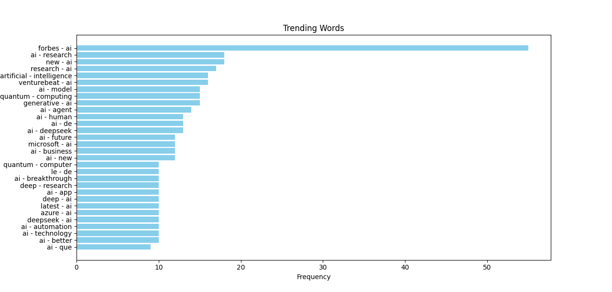

# Real-Time Trend Identification in Social Media using MapReduce & Big Data Technologies

This project aims to identify trending topics in real-time from social media platforms using Big Data technologies and the Hadoop MapReduce framework. It leverages large-scale data collection, processing, and visualization to uncover popular keywords and patterns from Twitter and news sources.

## Project Overview

In the era of digital communication, social media generates an immense volume of data every second. Recognizing trends from this data can offer valuable insights in domains like marketing, crisis management, public opinion analysis, and more. This project extracts and analyzes data from Twitter and news APIs to identify real-time trends using the MapReduce programming model.

## Tech Stack

| Component           | Technology                           |
|---------------------|--------------------------------------|
| **Framework**       | Hadoop MapReduce                     |
| **Data Storage**    | HDFS (Hadoop Distributed File System)|
| **Programming**     | Python                               |
| **Preprocessing**   | Pandas                               |
| **Text Processing** | NLTK                                 |
| **Visualization**   | Matplotlib                           |
| **Data Sources**    | Twitter API, News API                |

## Key Features

- Real-time data fetching from social platforms using APIs  
- Preprocessing and cleaning of unstructured text data  
- Word count and word co-occurrence analysis  
- Identification of top keywords and trending topics  
- Data visualization using Matplotlib  
- Scalable processing with Hadoop MapReduce on HDFS  

## How It Works

1. **Data Collection:**  
   Fetches tweets and news headlines using Twitter API and News API.

2. **Data Preprocessing:**  
   Cleans the raw text, removes stopwords, tokenizes, and prepares it for processing.

3. **MapReduce Analysis:**  
   - **Mapper:** Extracts and emits word occurrences.  
   - **Reducer:** Aggregates and counts the frequencies to find top words.

4. **Trend Identification:**  
   Analyzes co-occurrence and frequency of words to determine emerging trends.

5. **Visualization:**  
   Displays the results via graphs and dashboards in Matplotlib.

## Results
- Collected and processed over 200MB of data per run.

- Extracted and cleaned 10,000+ word pairs.

- Visualized the top 30 trending pairs, with examples like ['forbes', 'ai'] and ['quantum', 'computing'].

- Ensured data quality through preprocessing (removing noise, links, punctuation, etc.)

## Future Work
- Deploy on cloud platforms (AWS EMR, EC2).

- Add real-time dashboards using Streamlit or Tableau Public.

- Optimize for edge computing for faster insights.

- Integrate advanced NLP models for sentiment detection.

